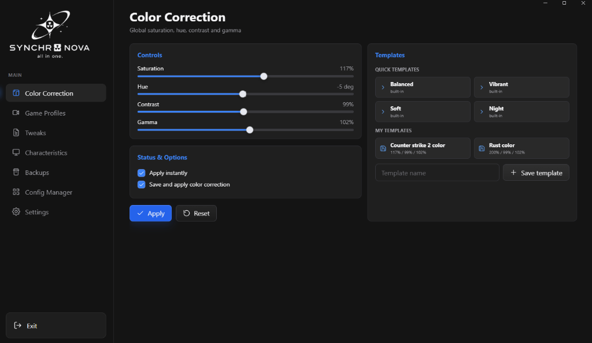
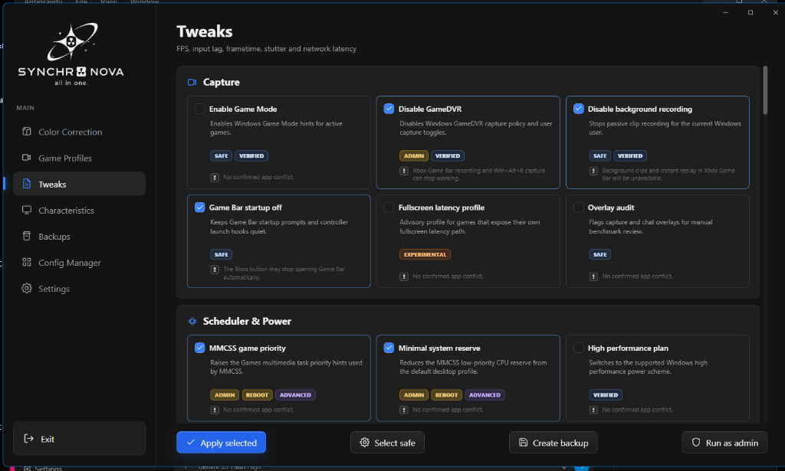

<div align="center">

# Synchro Nova

**High-Performance Windows System Management & Display Optimization Suite**

[](https://tauri.app/)
[](https://www.rust-lang.org/)
[](https://developer.mozilla.org/en-US/docs/Web/JavaScript)
[](LICENSE)
[](https://microsoft.com/windows)

</div>

---

## 🌟 Overview

**Synchro Nova** is a lightweight, responsive, and secure desktop utility designed for Windows gamers, power users, and system builders. Built with **Tauri v2** and **Rust**, it combines direct hardware-level display color controls, curated performance tweaks, and real-time hardware telemetry into a modern, minimalist interface.

---

## 📸 Screenshots

<div align="center">

### Color Correction & Display Calibration


### Performance & System Tweaks


</div>

---

## ✨ Features

- 🎨 **Game & Display Color Control**:
  - Live adjustment of **Vibrance**, **Saturation**, **Contrast**, **Gamma**, and **Hue**.
  - Per-game color profiles and quick-switch presets (*Balanced*, *Vibrant*, *Soft*, *Night*).
  - Instant background application via low-latency Windows display APIs.

- ⚡ **Curated Performance Tweaks**:
  - Safe and isolated system performance optimizations.
  - Granular selection with clear safety classifications and one-click application.
  - Built-in verification and state recovery.

- 📊 **Hardware & Characteristics Monitor**:
  - Real-time CPU utilization graph and hardware telemetry.
  - Detailed system specs, installed GPU/display driver information, and version inspection.
  - Low-spec optimization mode for minimal idle footprint.

- 💾 **Snapshots & Configurations**:
  - Instant configuration saving and loading.
  - Automatic backup system before applying system modifications.
  - Direct access to local storage directories.

- 🔒 **Hardened Security Model**:
  - Zero sensitive logic or elevated tokens in the frontend layer.
  - Strict Content Security Policy (CSP) blocking remote scripts, frames, and injection vectors.
  - Allowlisted, bounds-checked native commands executed in memory-safe Rust.

---

## 🛠️ Architecture & Tech Stack

| Layer | Technology | Description |
| :--- | :--- | :--- |
| **Core & Engine** | [Rust](https://www.rust-lang.org/) (2021 Edition) | Native system calls, Windows registry manipulation, hardware querying, security boundaries |
| **App Runtime** | [Tauri v2](https://tauri.app/) | Ultra-compact webview bridge with minimal memory overhead |
| **Frontend** | Vanilla JS / CSS3 / HTML5 | Modular ES6 architecture, high-DPI rendering, zero heavy UI frameworks |
| **Packaging** | NSIS / Portable Executable | Standalone portable single `.exe` or bundled offline NSIS setup |

---

## 🚀 Getting Started

### Prerequisites

Ensure you have the following installed on your Windows machine:
1. **[Node.js](https://nodejs.org/)** (v18+ recommended)
2. **[Rust & Cargo](https://www.rust-lang.org/tools/install)** (`x86_64-pc-windows-msvc` toolchain)
3. **[Microsoft Visual Studio C++ Build Tools](https://visualstudio.microsoft.com/visual-cpp-build-tools/)**

---

### Installation

Clone the repository and install frontend dependencies:

```bash
git clone https://github.com/Arean-Max/synchro-nova.git
cd synchro-nova
npm install
```

---

### Development

#### Run in Tauri Desktop Mode:
```bash
npm run dev
```

#### Run as a Local Web Preview:
```bash
npm run serve
```
Then open `http://127.0.0.1:65527` in your browser.

---

## 📦 Building for Production

### Quick Build (One-Click Batch)
Double-click `Build Synchro.bat` to automatically build and optimize the portable executable.

### Via NPM Scripts

- **Full Release Build (with NSIS installer)**:
  ```bash
  npm run build
  ```
  Output: `src-tauri/target/release/bundle/nsis/Synchro_0.1.0_x64-setup.exe`

- **Portable Executable Build**:
  ```bash
  npm run build:portable
  ```
  Output: `src-tauri/target/release/synchro.exe`

---

## 🛡️ Security & Privacy

Synchro Nova is engineered with strict defense-in-depth principles:
- **No Telemetry**: No external telemetry, tracking, or network callbacks are enabled by default.
- **Sandboxed IPC**: Tauri plugin permissions are explicitly minimized; native operations are allowlisted.
- **Safety Boundaries**: Registry tweaks and system state changes enforce pre-execution validation and require explicit administrative elevation.

For detailed security guidelines, refer to [`SECURITY_NOTES.md`](SECURITY_NOTES.md).

---

## 📄 License

This project is licensed under the [MIT License](LICENSE).
