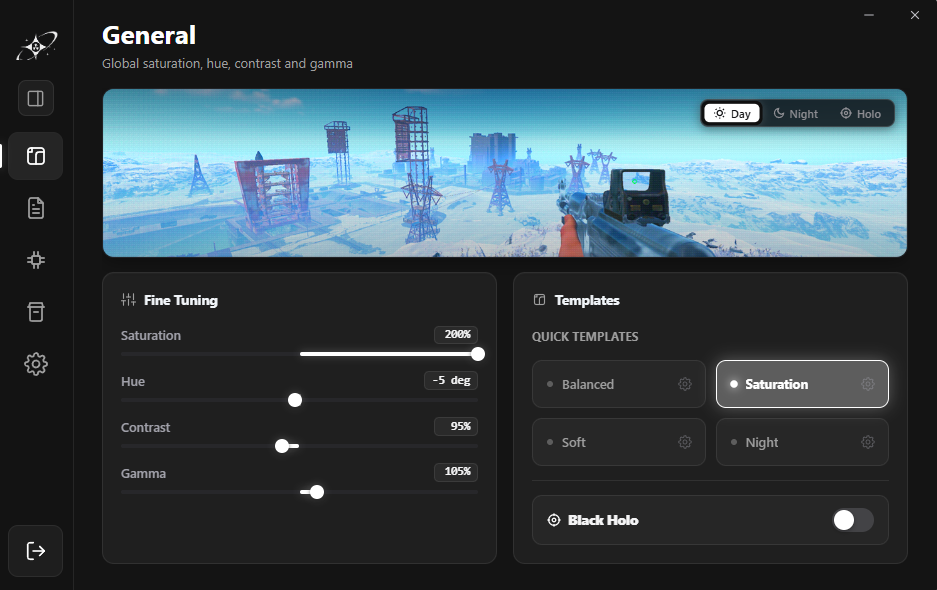

# Synchro Nova

<div align="center">

[](README.en.md)
[](https://t.me/synchronova)
[](https://github.com/Arean-Max/synchro-nova/releases)
[](LICENSE)
[-informational?style=flat-square)](https://microsoft.com/windows)

**Десктопная утилита для аппаратной цветокоррекции монитора, оптимизации задержки ввода и тонкой настройки Windows.**  
*Написана на Rust и Tauri v2. Потребляет ~2 МБ RAM в трее, использует 0% CPU в простое и работает без внедрения в память сторонних процессов.*

<br>



</div>

---

## О проекте

Synchro Nova создавалась как замена громоздким оверлеям и сомнительным утилитам, которые забивают оперативную память, внедряются в системные библиотеки и вызывают конфликты с античитами в играх. 

Приложение объединяет аппаратную регулировку сочности (Digital Vibrance), гамма-калибровку через LUT монитора, аудит драйверов и системные твики в одном легковесном решении без рекламы, телеметрии и фоновых служб.

---

## Основные возможности

### 1. Аппаратная цветокоррекция (Display Calibration)
- **Управление через Windows GDI & Magnification API**: сочность (vibrance), насыщенность, гамма, контраст и цветовой тон без задержки кадра и без инпут-лага.
- **Режим Black Holo**: калибровка контраста и глубоких теней в соревновательных шутерах (CS2, Rust, Apex, Tarkov) без потери деталей в светлых участках.
- **Профили для игр**: возможность привязать параметры калибровки к конкретным играм.

### 2. Системные твики и оптимизация отклика (System Tweaks)
- **Проверенные параметры**: отключение системной телеметрии, настройка таймера, приоритеты MMCSS, полноэкранная оптимизация (FSO), сетевой стек и TCP autotuning.
- **Резервное копирование и откат**: перед внесением изменений утилита создаёт снимок реестра (`.reg`) для возможности отката в исходное состояние.
- **Прозрачность**: каждая команда и ключ реестра документированы в интерфейсе и в [справочнике по твикам](docs/TWEAKS_REFERENCE.md).

### 3. Анализ драйверов и ПК (Hardware & Drivers)
- Определение видеокарты, текущей версии видеодрайвера и даты его выпуска.
- Проверка актуальности драйверов NVIDIA, AMD, Intel со ссылками на официальные страницы вендоров.
- Мониторинг загрузки процессора и оперативной памяти через нативный Windows PDH (Performance Data Helper).

### 4. Неинвазивная архитектура (Process Isolation)
- **Пользовательский режим**: приложение не обращается к чужим процессам (0 вызовов `PROCESS_VM_READ` или `PROCESS_VM_WRITE`).
- **Без инъекций и перехватов**: отсутствие вызовов `CreateRemoteThread`, хуков ввода (`SetWindowsHookEx`) и графических перехватов DirectX/Vulkan.
- Калибровка выполняется внешне — на уровне Windows DWM и LUT дисплея.

---

## Производительность и ресурсы

| Показатель | Synchro Nova v2.0 | Типичный софт на Electron |
|---|:---:|:---:|
| **Оперативная память в трее** | **~1.5 – 3 МБ** | 120 – 350 МБ |
| **Нагрузка на CPU в фоне** | **0.0% (0 прерываний таймера)** | 0.5 – 2.5% |
| **Время холодного старта** | **< 0.3 сек** | 2.5 – 6.0 сек |
| **Внешний сетевой трафик** | **0 байт (телеметрия Chromium вырезана)** | Постоянные аналитические запросы |

> [!NOTE]
> В версии 2.0 фоновый цикл проверки калибровки переведён на события Windows `Condvar`. При нейтральном профиле поток полностью засыпает в ядре операционной системы, позволяя процессору переходить в глубокие C-states.

---

## Скачать и установить

Свежие сборки всегда доступны на странице [**Releases**](https://github.com/Arean-Max/synchro-nova/releases):

- **Портативная версия (`synchro:portable.exe`)** — автономный бинарник `synchro.exe`, запускается сразу из любой папки или с флешки, не требует установки и не оставляет следов в системе. Также доступен архив `Synchro-Nova-2.0.0-Portable.zip`.
- **Установщик (`Synchro.Nova_2.0.0_x64-setup.exe`)** — классический установщик с ярлыком на рабочем столе, интеграцией в системный поиск Windows («synchro») и чистым деинсталлятором.

### Проверка контрольной суммы (SHA-256)
Для проверки подлинности скачанного файла откройте PowerShell в папке с файлом:
```powershell
Get-FileHash .\synchro.exe -Algorithm SHA256
```
Сверьте полученный хэш со значениями в файле `SHA256SUMS.txt` на странице релиза.

---

## Сборка из исходников

### Требования
- [Node.js](https://nodejs.org/) (версия 18+)
- [Rust](https://www.rust-lang.org/) (stable `x86_64-pc-windows-gnu` или `x86_64-pc-windows-msvc`)
- [Tauri CLI](https://tauri.app/)

### Инструкция по сборке
```bash
# 1. Клонируйте репозиторий
git clone https://github.com/Arean-Max/synchro-nova.git
cd synchro-nova

# 2. Установите зависимости
npm install

# 3. Запуск в режиме разработки
npm run dev

# 4. Сборка релизного установщика и бинарника
npm run build
```

Собранный исполняемый файл появится в `src-tauri/target/release/synchro.exe`, а установщик — в `src-tauri/target/release/bundle/nsis/`.

---

## Сообщество и поддержка

- **Официальный Telegram**: [t.me/synchronova](https://t.me/synchronova) — обновления, обсуждения, идеи и помощь.
- **GitHub Issues**: нашли ошибку или хотите предложить улучшение? [Создайте issue](https://github.com/Arean-Max/synchro-nova/issues).

---

## Лицензия

Проект распространяется под свободной лицензией [MIT](LICENSE).
